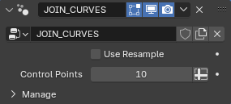
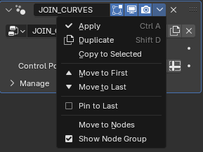

# **Join Hair Curves**

This is **addon** is a tool to make joining **Blender's** ***hair curves*** a simplified process with the click of a button.

## Usage
1) *Select* the hair curves you want to join.   Make sure that you select the hair curve that you want to join to last *(make it the active object)*.
2) Press the "Join" button once you're satisfied with your selection.
3) A new goemetry nodes modifier named **"JOIN_CURVES"** will be added to the active object's modifier stack.   In this modifier you have the option to resample all of the hair curves to have the same amount of control points on each spline.   *Check* the *"Use Resample"* box and setting the desired number of control points or you can leave the *"Use Resample"* box unchecked to keep the hair curves unmodified.

4) Apply the **"JOIN_CURVES"** modifier when you're ready to finalize the process.

***Note:***

*If you want to make the joined object a new object (to preserve all of the objects), add an empty hair curve with no geometry and make that the active object (last selected object) as seen below.*

## Installation
1) *Download* the .zip file.
2) Open the Preferences Panel.
3) Open the *Add-ons* Tab.
4) Click on the *drop-down* button on the top right.
5) Select *Install from Disk*
6) Navigate to the .zip location.
7) Select the ***Join_Hair_Curves.zip***

